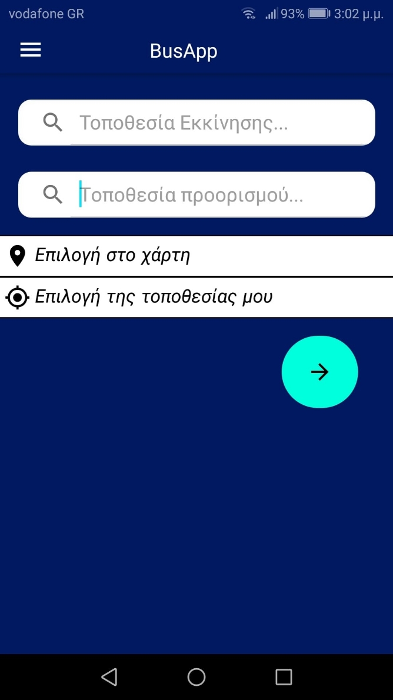
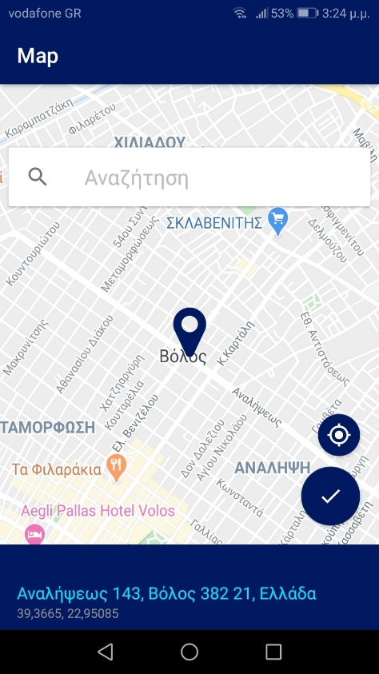
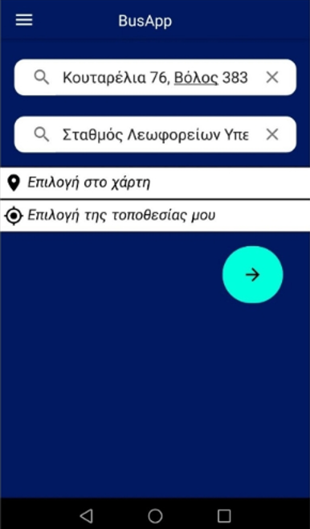
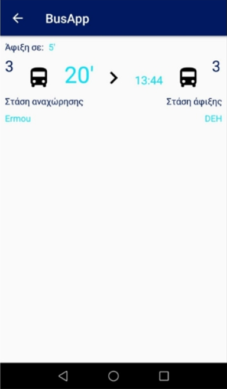
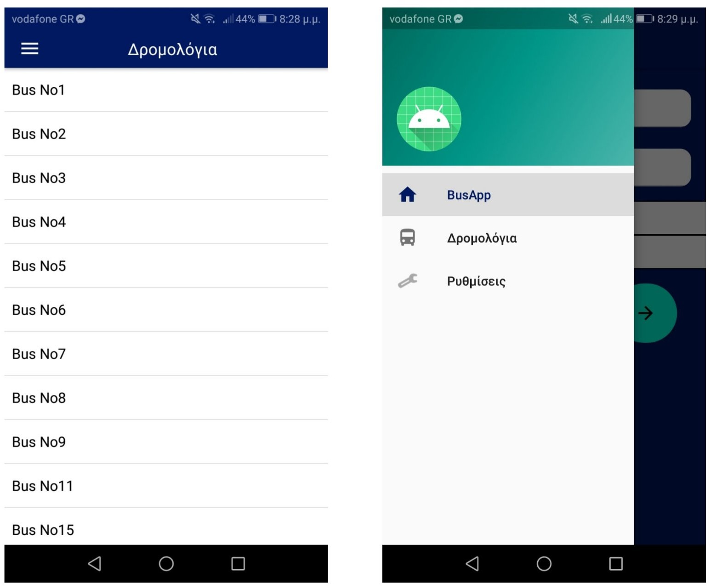
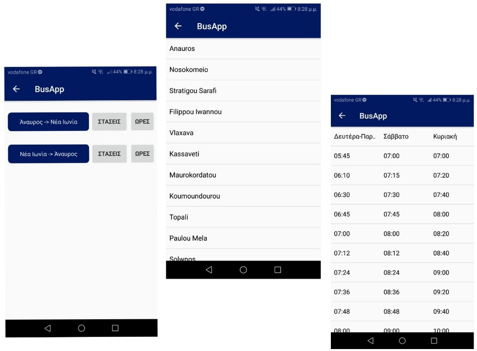
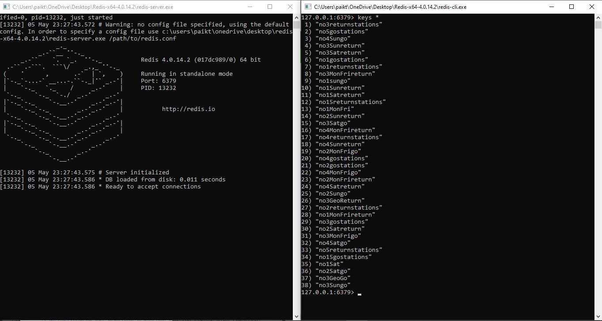

# **Application** **for** **the** **timetables** **of** **the** **urban** **transport** **of** **the** **city** **of** **Volos, Greece**

The application was developed on the Android Studio platform and consists of two main parts. The first is the one where the user enters a starting location for the journey, a destination location and the application uses this data and displays on the screen the best bus option for completing the journey. The second part of the application consists of several options with the bus lines and the result is the route with the times and days of the bus line in question.

## **User defines pick-up and drop-off locations**

When the application starts, the user sees the home page as indicated in Fig 1(a). Initially, he will choose his starting location based on two options: to choose from the map or to choose his own location. If the user decide to select from the map, Figure 1 (b) appears. The user is given the possibility to move the pin to any point on the map or even search for a point.

<p align="center">
  
  &nbsp;&nbsp;&nbsp;&nbsp;&nbsp;&nbsp;&nbsp;&nbsp;&nbsp;&nbsp;&nbsp;&nbsp;&nbsp;&nbsp;&nbsp;&nbsp;&nbsp;&nbsp;&nbsp;&nbsp;&nbsp;&nbsp;&nbsp;
  
  <figcaption>Fig 1. (a) Application home page and (b) Location selection from map. </figcaption>
</p>

Once the user have gone through the process of selecting a starting and destination location by selecting two points on the map, you get a result, Figure 2 (a), where the locations have been automatically filled in and so we can continue the process of searching for the appropriate route. The operation when selecting the user's location is also similar, where access to the device location is requested and then the starting location is filled in appropriately. Details of the code and how the required data is obtained are discussed in detail later.
By clicking on the arrow, the user is taken to Figure 2 (b) where the following information is displayed: the bus line that is suitable for the chosen route (from starting location to destination), the time of arrival of the bus at nearest stop, total journey time, the departure stop, the estimated estimated time of arrival at the destination and the estimated time of arrival at the destination. Details on the implementation and the selection of the most appropriate line are presented in sections 2 and 3.

<p align="center">
  
  &nbsp;&nbsp;&nbsp;&nbsp;&nbsp;&nbsp;&nbsp;&nbsp;&nbsp;&nbsp;&nbsp;&nbsp;&nbsp;&nbsp;&nbsp;&nbsp;&nbsp;&nbsp;&nbsp;&nbsp;&nbsp;&nbsp;&nbsp;
  
  <figcaption>Fig 2. (a) The user is ready to search for a route. (b)The result of the search and the proposed route with information. </figcaption>
</p>

## **User gets informed about the bus lines and the time schedules**

In the second part of the application, the user can select the bus line he wants to see information about the stops and departure times from the starting point. To get to it, he selects the appropriate option through the menu that has been configured and is shown in Figure 3 (b). Then after selecting the line, Figure 3 (a) is displayed. As we know every line has a start and end point. So, we have two directions with separate stops and times. Therefore, the user will have the appropriate options. The display function of the stops and times is designed so that if they do not fit on the screen the user can scroll down (Figure 5 center and right).


<p align="center">
  
  <figcaption>Fig 3. (a) The city bus routes in Volos city and (b) the navigation menu. </figcaption>
</p>

<p align="center">
  
  <figcaption>Fig 4. (a) There are the two directions of the respective line. (b) The stops from "Anavros" to "Nea Ionia" and (c) the time schedule for the same line. </figcaption>
</p>

## **Data source and Database management system**

The data were taken from the official website of the urban transport authority of city of Volos [1]. Due to the lack of data regarding the locations of the longitude, latitude, these were obtained experimentally, crossing the bus line 3 (both directions).

The data management system used is a type of NoSQL database and specifically a Key-value store. The **Redis** database is the one that was chosen for this application and was deemed suitable.

### *Downloading and installing Redis*

The official Redis website provides installation guides for Linux only. For installation on Windows, it is sufficient to download the latest version from GitHub [2]. After downloading, we go to the folder and simply execute the redis-server file. This runs the server locally which will contain the data we will import, Figure 5 (left). By executing the redis-client file we can execute various commands to import, delete and retrieve data from the server, Figure 6 (right). In this particular snapshot we executed the keys * command which displays all the keys present in the database. In this case, they are lists and geodata, i.e. keys with coordinates and members.

<p align="center">
  
  <figcaption>Fig 5. Connecting and retrieving data from the server. </figcaption>
</p>

### *Accessing the server through the application*

To access the data from the application, we need a Redis API for Java programming language. From the official website [3] we can see which one is suitable for us. There are many for this language, so Lettuce was chosen. It is easily downloaded from GitHub [5] and following the instructions we import it into Android Studio [6]. Guided by the documentation [4], we can call the necessary functions in our files to connect to the server and use the data. 


## Java Code

We first create the client that will connect to the database, the connection and define the redis commands.

After that, we execute redis commands syncCommands.llen and syncCommands.lindex. With the former we get the size of the list and the latter we get the contents of a node from the list based on the index. In this particular section of code, we derive the stops of a particular line to display to the user, Figure 4 (b).


Here is the Java method to connect to a Redis server and process data:

```java
public void connectToRedis(String[] stations) {

  int i;

  RedisClient redisClient = RedisClient.create("redis://192.168.1.10:6379/0");
  StatefulRedisConnection<String, String> connection = redisClient.connect();
  RedisCommands<String, String> syncCommands = connection.sync();

  if(position.contains("togo")) {
    
    i = 0;
    while (i < syncCommands.llen(stations[Integer.parseInt(String.valueOf(position.charAt(0)))])) {
      arrayList.add(syncCommands.lindex(stations[Integer.parseInt(String.valueOf(position.charAt(0)))], i));
      i++;
    }
  } 
  else {
    i = 0;
    while (i < syncCommands.llen(stations[Integer.parseInt(String.valueOf(position.charAt(0)))])) {
      arrayList.add(syncCommands.lindex(stations[Integer.parseInt(String.valueOf(position.charAt(0)))], i));
      i++;
    }
  }

  connection.close(); 
  redisClient.shutdown();
}
```

## References

1.	http://www.astikovolou.gr/
2.	https://github.com/tporadowski/redis/releases
3.	https://redis.io/clients
4.	https://lettuce.io/core/release/api/
5.	https://github.com/lettuce-io/lettuce-core/releases
6.	https://lettuce.io/docs/getting-started.html
7.	https://lettuce.io/core/release/api/
8.	https://stackoverflow.com/
